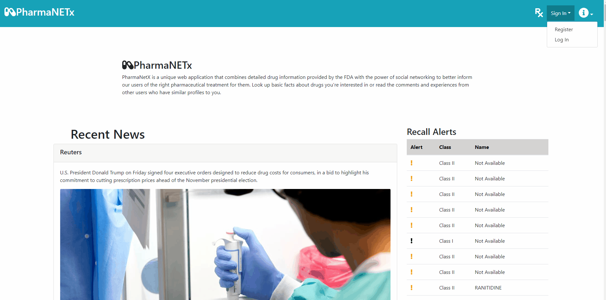
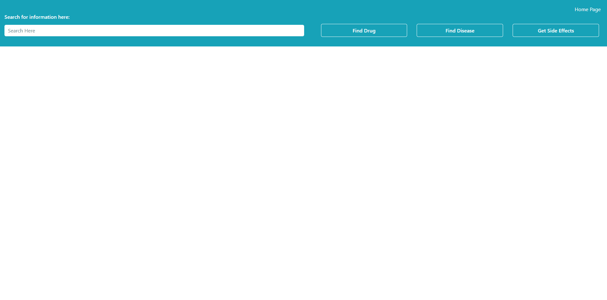

# PharmaNetX
PharmaNetX is a unique web application that combines detailed drug information provided by the FDA with the power of social networking to better inform our users of the right pharmaceutical treatment for them. Look up basic facts about drugs you're interested in or read the comments and experiences from other users who have similar profiles to you.

# Getting Started

## Prequisites
Download Node.js and npm for your platform [here](https://nodejs.org/en/download/).
Verify that you have npm installed. 
```
npm -v
```
Download [MySQL Workbench](https://dev.mysql.com/downloads/workbench/).
Download [Maven] and verify its installation(https://maven.apache.org/).
```
mvn -v
```

## Installing
Clone the front-end repository
```
git clone https://github.com/wakira765/cs4550-sp20-group8-project.git
```
Clone the back-end repository
``` 
git clone https://github.com/wakira765/cs4550-sp20-team8-project-server.git
```

# Deployment

## Configure and Launch the Back-end
To setup the database, create a local connection in MySQL Workbench. Instructions can be found [here](https://dev.mysql.com/doc/workbench/en/wb-mysql-connections-new.html).\
Take note of the name of the connection, username and password as they will be used later on. 

Open the back-end repository.\
Go to the application.properties file in the back-end repository (src/main/resources/application.properties).\
Change the spring.datasource.url to "jdbc:mysql://localhost:3306/NAME-OF-LOCAL-CONNECTION".\
Change the spring.datasource.username to the username you used earlier.\
Change the spring.datasource.password to the password you used earlier.

Then run the following command:
```
mvn clean install
```
This produces the jar file which will launch the back-end.
Run the jar file:
```
C:~\cs4550-sp20-team8-project-server> java -jar target/server-0.0.1-SNAPSHOT.jar
```
The back-end services should now be properly launched.

## Launch the Front-end
Open up the front-end repository.
Run the following command:
```
npm start
```
The front-end should be launched and communicating with the back-end services.

# Demo
Search relevant news articles and drug recalls on your home page:


Register for an account and edit your profile:


Search for drug information; once you have an account you can also post comments:


The entire web app is responsive and mobile friendly:


  


# Built With
- [React](https://github.com/facebook/react)
- [Redux](https://github.com/reduxjs/redux)
- [Maven](https://maven.apache.org/)
- [Bootstrap](https://getbootstrap.com/)
- [FontAwesome](https://fontawesome.com/)
- [Spring Boot](https://spring.io/projects/spring-boot)

# Authors
 - Akira Watanabe
 - Daniele Zhan
 - Kelvin Ma

